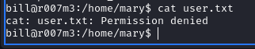

# Try Hack Me R00TM3 Room Write Up

## Port Scanning
First of all I scan the open ports with nmap and found 3 ports open.
```
PORT     STATE SERVICE
21/tcp  open  ftp
22/tcp  open  ssh
80/tcp  open  http
```

So I check the http first and found nothing in the website. Then I decided to check the ftp.

# FTP login
I tried to login to the ftp with anonymous and it worked.


then i got a file name *read_me.txt*

Inside the file, it says:
```
Hey Mary,
I told you to change the hidden folder in http web server. 'iDONTcare' is not a secure folder. Also WHERE IS MY SSH LOGIN FILE. Whatever you did, just give me back the file.
Bill
```
## HTTP hidden directory discovery
So i know that there's a hidden directory called */iDONTcare* in http server.
When I check it, I got a text message.


It look a little suspicious so I use CTRL+U to view the source code and I got another hidden directory.


But when i access the /s3cr3t folder it's just a blank page.


So I decided to run gobuster and check it.
and it has a hidden file name *mysecret*.
When I open it, It say:
```
the hidden folder is /V2S7jjDrk6Ogjj1
and there is your ssh key also
```

So I got another hidden directory.
When I check it, it's also a blank screen. I tried gobuster and it isn't working too.
So since I was looking for the id_rsa(user for ssh login) file I enter /V2S7jjDrk6Ogjj1/id_rsa and boom, I've got the ssh login key.


## SSH login

Also We saw that Bill was asking Mary for his ssh key so I know this is the key for Bill.
I change the permission of the file to 600 and then I tried to login with 
```
ssh -i id_rsa bill@machine_ip
```
But it said it need a passphrase.


So i used ssh2john and cracked the passphrase.


And the passphrase is *babygurl*.

Now I login to ssh successfully.

## USER flag

First I tried **ls -la** but there's nothing there.
I know there is another user name **Mary**, so i change directory to /home .
And there it is one for Bill and one for Mary.


I change dirctory to /home/mary and I found three files.


I used the command
```
cat user.txt
```
to try and get the user flag, but it said permission denied.


But when i *cat* the other two files, It's okay.
The first one *backup.sh* have:


and the second one *check_s3cr3t* have:


So there is a secret directory in the system called **s3cr3t**.
If you remember in *backup.sh*, it save files from /var/www/html/ to /s3cr3t/backup.zip
So I go to /s3cr3t and found nothing but backup.zip.
And I tought maybe there is an hidden file.
So I used ls -la and there is a file name **.hidden**

Inside the file there is


We have mary's password now.
So let's login to mary account by
```
su mary
```
and enter the password.

now I can cat the /home/mary/user.txt and get the flag.

# Privilege escalation
Now, do you remember in *backup.sh*,it save the files from /var/www/html/ to /s3cr3t/backup.zip?
Since I login, I haven't execute the file yet, but there's already one. 
So I check the crontab with
```
cat /etc/crontab
```


as we can see, there is a cron job run by root and the file is in mary home directory.
So let's edit the *backup.sh* file.

I edited it and after a minute the the */bin/bash* will have a suid and we can login as root.


Now our bash file have an suid bit so let's login as root by
```
/bin/bash -p
```

and boom we are root now. Now just go to /root/ and cat /root/root.txt and you'll get the flag.


